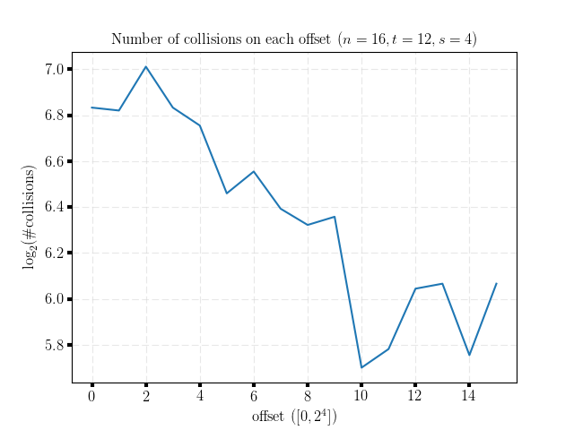
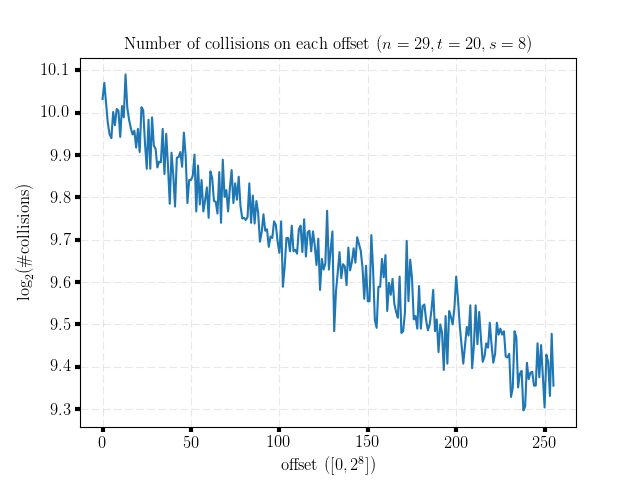
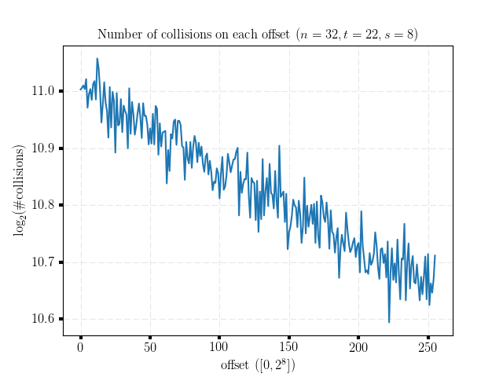

# Experiments on the Distribution of Offsets of Collisions #

This program check the distribution of offsets of collisions on the computation chains when searching for collisions.
The setting is as follows: we evaluate <MATH>2t</MATH> chains of length <MATH>2s</MATH> by iterating an <MATH>n</MATH>-bit random mapping <MATH>f</MATH>. At each offset on the computation chain, there might be some collisions. A question is "How is the collisions distributed along the chains". To answer this question, we perform experiments counting the number of collisions on each offset.

## Experiments ##

We simulate the <MATH>n</MATH>-bit random mapping <MATH>f</MATH> using chopped AES-128 (obtained by fixing an arbitrary key and <MATH>128-n</MATH> bits of the input and take <MATH>n</MATH> bits as the output, where <MATH>n</MATH> is in {12, ..., 32}). We check the distribution of collision offsets in the following cases:
- Case 1: <MATH>t + 2s > n</MATH>, in particular
  + \#define s ((n + 3) / 4)
  + \#define t (2 * (n + 2) / 3) 
- Case 2: <MATH>t + 2s < n</MATH>, in particular
  + \#define s ((n + 7) / 8)
  + \#define t ((n + 2) / 3)  
- Case 3: <MATH>t + 2s</MATH> slightly larger or less than <MATH>n</MATH>, in particular
  + \#define s ((n + 7) / 8)
  + \#define t (5 * s)
- Case 4: <MATH>t + 2s</MATH> almost equals to <MATH>n</MATH>, in particular
  + \#define s ((n + 3) / 4)
  + \#define t ((n + 1) / 2)

We directly use implementations of AES-128 included in IPPCP (Cryptography for Intel Intergrated Performance Primitives) in IPP (Intel Integrated Performance Primitives). Thus, one may need to install [IPP](https://software.intel.com/en-us/intel-ipp) and [IPPCP](https://software.intel.com/en-us/get-ipp-cryptography-libraries) to compile and run this experiment.

- This program has been tested on the following platforms:
  + Ubuntu 16.04.3 LTS (GNU/Linux 4.10.0-33-generic x86_64) + g++ (GCC) 5.4.0 + icpc (ICC) 17.0.4

- Compiling:
  + two parameters can be defined manually during compiling:
     * `nmin`: the minimum value of <MATH>n</MATH> (default 12)
     * `nmax`: the maximum value of <MATH>n</MATH> (default 32)
  + two parameters must be defined in the source file [declares.h]()
     * `t`: the binary logarithm of the number of evaluated chains
     * `s`: the binary logarithm of the length of evaluated chains
  + example:
     * > make 
     * > make nmin=12 nmax=28

## Results ##

As pointed out by authors in [DL16](https://hal.inria.fr/hal-01407953/document), when <MATH>t + 2s <= n</MATH>, each evaluated chain is not expected to collide with more than one different chain. In this case, the collision offset is roughly uniformly distributed in the interval <MATH>[0, 2s]</MATH>. On the other hand, when <MATH>t + 2s > n</MATH>, there is an obvious decrease on the number of collisions with the increase of offsets. Note that, there is a more obvious decrease on the number of images with the increase of offsets (due to the entropy loss phenomenon).

The following figures show examples of the decrease on the number of collisions with the increase of offsets (results obtained in Case 1, plotted using [matplotlib](https://matplotlib.org/)):

 

 

## References ##
[DL16] Itai Dinur and Gaëtan Leurent. Improved Generic Attacks Against Hash-Based MACs and HAIFA. Algorithmica, November 2016. https://hal.inria.fr/hal-01407953/document
